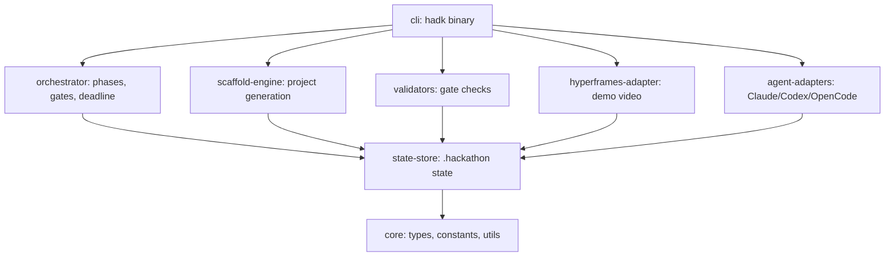

# Architecture Overview

HADK (Hackathon AI DevKit) 2.1.5 is an **AI-native Competition Engineering
Harness**. It turns any competition brief into a winning strategy, a locked
MVP scope, an executable project scaffold, a reliable demo, a demo video
project, and a submission-ready package.

> **v2.1.1** fixes a regression where `hadk brief confirm` left the canonical
> competition state empty. **v2.1.2** additionally normalizes ` ET (Extended)`
> deadlines to ISO for correct `Time remaining`. See `CHANGELOG.md`.

This document describes the system at a glance. Deeper dives live alongside it:

- [State model](./state-model.md)
- [Orchestrator](./orchestrator.md)
- [Scaffold engine](./scaffold-engine.md)
- [HyperFrames integration](./hyperframes-integration.md)
- [Architecture decisions (ADRs)](./decisions/)

## Product statement

> Turn any competition brief into a winning strategy, scoped prototype,
> executable project scaffold, reliable demo, and submission-ready package.

## Two install layers, one source of truth

| Layer | Command | Audience |
|---|---|---|
| Standalone skills | `npx skills add agenticbernie/hackathon-ai-devkit` | Users who only want the markdown skills in their agent. |
| Full harness | `curl -fsSL .../install.sh \| bash` | Users who want the CLI, state, validators, scaffold, and video pipeline. |

Both layers read the **same** `skills/` tree, described by `manifest.yaml`.
There is exactly one copy of every skill (see
[ADR-003](./decisions/ADR-003-single-source-skills.md)).

## Package map

The harness is a pnpm workspace monorepo
([ADR-001](./decisions/ADR-001-monorepo-architecture.md)). Dependencies flow
one way:



| Package | Responsibility |
|---|---|
| `@hadk/core` | Shared types, constants (phases, scoring weights, deadline thresholds), `Result<T,E>`, YAML utilities. |
| `@hadk/state-store` | `.hackathon/` lifecycle: init, atomic save/load, migration, checkpoints, artifacts. |
| `@hadk/orchestrator` | Phase/gate model, idea scoring, deadline policy, status, next-action engine. |
| `@hadk/scaffold-engine` | Data-driven project scaffolding from the locked scope. |
| `@hadk/validators` | All validation gates (state, registry, scope, scaffold, video, …). |
| `@hadk/hyperframes-adapter` | Demo-video project generation and honest render reporting. |
| `@hadk/agent-adapters` | Canonical protocol + thin per-agent wrappers. |
| `@hadk/cli` | The `hadk` binary wiring everything together. |

## The pipeline

```text
setup → ingest → strategy → idea → scope → scaffold → build → demo → video → judge → submission
```

Each phase has a gate. The orchestrator advances phases only when the relevant
gate passes, and `hadk next` inspects real state to recommend the correct next
command. Deadline pressure steps the harness down through execution modes
(`full → fast → demo_first → freeze_scope → no_new_features → submission_only`)
so the most important work always ships first.

## Cross-cutting principles

- **Result-based errors** ([ADR-002](./decisions/ADR-002-result-error-handling.md)):
  every failure is actionable, never a bare stack trace.
- **Atomic, resumable state** ([ADR-005](./decisions/ADR-005-atomic-state-checkpoints.md)):
  a session can always resume; checkpoints enable rollback.
- **Non-destructive by default**: scaffolding and installation never overwrite
  user work without `--force`.
- **Honest reporting** ([ADR-006](./decisions/ADR-006-honest-render-reporting.md)):
  incomplete work (e.g., an unrendered video) is reported truthfully.
